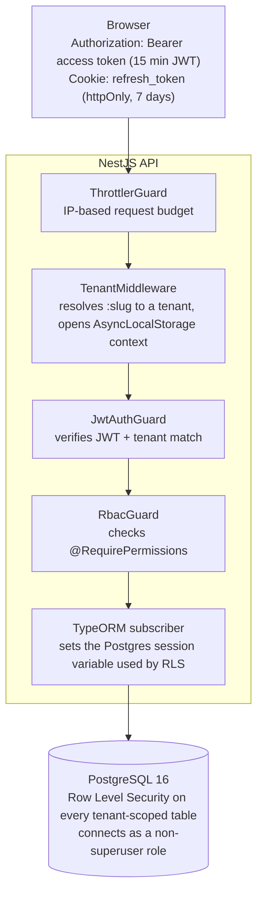

# Multi-Tenant Auth System

A self-hosted authentication and authorization backend for multi-tenant B2B
applications, plus a TypeScript client SDK for consuming it. You run it against
your own PostgreSQL database; there is no per-user billing and no third-party
data custody.

**At a glance:**

- Each customer's data is kept separate by the database itself, not just by
  application code — so a bug in a query can't accidentally leak one
  customer's data to another.
- Login sessions are protected against token theft: if a stolen session
  token gets reused, the system detects it and shuts the whole session down.
- Ships as a working backend, a TypeScript SDK to talk to it, and a demo app
  to try every feature by hand — see it running with one command
  (`docker compose up`).

The repository is a monorepo with three parts:

- **`apps/api`** — the NestJS authentication/authorization server. This is the
  actual product.
- **`package`** — `@auth-moon/sdk`, the TypeScript client for talking to the
  API. This is what a consuming application depends on.
- **`apps/demo`** — a React reference client built on the SDK, used to
  exercise every API feature manually (login, RBAC, audit log, rate limiting,
  tenant management).

## Why it exists

Every multi-tenant SaaS product needs the same building blocks: tenant
isolation, login/session management, role-based permissions, and an audit
trail. This project focuses on two design goals:

- **Database-enforced tenant isolation** using PostgreSQL Row Level Security
  (RLS), not just application-code checks.
- **Self-hosted deployment** with full ownership of the authentication data —
  everything lives in a Postgres database you control.

## Why I built this

I built this to go deep on authentication and authorization — the part of a
system most developers wire up with a library and never look at again. I
wanted to actually understand the security decisions behind it: how tokens
should be rotated and protected against theft, how tenant data should be
isolated, and roughly how a provider like Auth0 or Clerk is built under the
hood, instead of only ever consuming that as a black box.

Multi-tenancy specifically interested me because it's not a SaaS niche — it's
the architecture behind most B2B software that serves many organizations from
one codebase: ERPs, CRMs, project-management tools, helpdesk platforms.
Building the isolation and permission model myself, rather than trusting a
managed provider to have gotten it right, was the only way to actually
understand those trade-offs instead of taking them for granted.

## Architecture



### Request lifecycle

For a request like `GET /acme/api/users`:

1. `ThrottlerGuard` checks the client IP against a global request budget.
2. `TenantMiddleware` extracts `acme` from the URL, looks up the tenant row,
   and opens an `AsyncLocalStorage` context carrying that tenant's id for the
   rest of the request.
3. `JwtAuthGuard` verifies the JWT signature/expiry, then checks that the
   token's `tenantId` claim matches the tenant resolved in step 2 — a token
   issued for one tenant is rejected on another tenant's routes even if the
   signature is valid.
4. `RbacGuard` checks the `@RequirePermissions(...)` metadata on the route
   against the caller's permissions.
5. A per-route `@RateLimit()` decorator (if present) applies a second,
   identity-aware rate limit (e.g. keyed by tenant + email for login, to catch
   credential stuffing across rotating IPs — separate from the IP-based
   throttle in step 1).
6. The repository issues a query. A TypeORM subscriber
   ([`rls.subscriber.ts`](apps/api/src/database/rls.subscriber.ts)) sets
   `app.current_tenant_id` on the connection immediately before the query
   runs, using `set_config` with `SET LOCAL` semantics inside a transaction
   (auto-reset on commit/rollback) or session-level `SET` outside one
   (explicitly reset afterward).
7. Postgres RLS policies filter every row by
   `tenant_id = app_current_tenant_id()`. A query with no `WHERE` clause at
   all still cannot return another tenant's rows.

No single layer is trusted alone — tenant isolation is enforced twice
(application routing + database policy), and authentication/authorization are
separate guards run in a fixed order.

### The platform (super-admin) account

There's no separate auth system for the account that manages tenants
themselves. A migration seeds one reserved tenant row (slug `platform`, fixed
id `00000000-0000-0000-0000-000000000000`) with an admin user whose role has
every permission. Logging in as the platform admin resolves through the exact
same `TenantMiddleware` → `JwtAuthGuard` → RLS path as any real tenant — the
only different routes are tenant *management* itself
([`platform-tenant.controller.ts`](apps/api/src/modules/platform/platform-tenant.controller.ts)),
which are mounted on a flat `platform/api/tenants` prefix instead of
`:tenant/api/...`, since creating/listing tenants is inherently cross-tenant.
The JWT `tenantId` cross-check described above means a platform-issued token
can't be replayed against a real tenant's routes, and vice versa.

### Session model

- **Access token**: short-lived JWT (15 min default), verified by signature
  only — no database lookup per request. Kept in memory on the client, never
  in `localStorage`.
- **Refresh token**: a random token, stored server-side only as a SHA-256
  hash, delivered to the client via an `httpOnly` cookie. Each refresh
  **rotates** the token — the old hash is marked revoked, a new one is issued.
- **Replay detection**: if an already-revoked refresh token is presented
  again (a sign it was stolen and used out of order), the entire token
  "family" for that login session is revoked, ending all sessions derived
  from it.

## Repository layout

```
apps/api/src/
  common/        guards, decorators, filters, middleware, domain events
  config/        env validation (Zod), TypeORM config
  database/      base entity, RLS subscriber, migrations
  modules/
    auth/        login/refresh/logout, refresh-token rotation, JWT strategy
    user/        user CRUD, registration, password hashing (Argon2id)
    rbac/        roles, permissions, per-tenant role seeding
    tenant/      tenant CRUD, tenant context, tenant-resolution middleware
    audit/       event listeners → append-only audit_logs table
    rate-limit/  sliding-window in-memory limiter behind a pluggable interface
    platform/    cross-tenant endpoints for the platform (super-admin) account
    demo/        dev-only seed endpoint, excluded when NODE_ENV=production
package/src/     @auth-moon/sdk — see package/README.md
apps/demo/src/   reference React client (pages/, components/, hooks/, contexts/)
docker/          init.sql (extensions + app_user role), rls.sql (reference copy of RLS policies)
```

## Running it

Requires Docker.

```bash
git clone <repo-url>
cd Multi-tenant-auth-system
cp .env.example .env          # then edit JWT_SECRET and PLATFORM_ADMIN_PASSWORD
docker compose up
```

This starts Postgres, runs all migrations automatically on API boot
(`migrationsRun: true`), and starts the API and demo containers.

- API: `http://localhost:3000`
- Demo: `http://localhost:5173`
- A platform tenant with slug `platform` and an admin account (from
  `PLATFORM_ADMIN_EMAIL` / `PLATFORM_ADMIN_PASSWORD`) are seeded on first boot.

To run the API standalone (outside Docker) for development:

```bash
cd apps/api
cp .env.example .env          # point DB_HOST at your local Postgres
npm install
npm run start:dev
```

### Creating a tenant

```bash
curl -X POST http://localhost:3000/tenants \
  -H 'Content-Type: application/json' \
  -d '{"name":"Acme Corp","slug":"acme","adminEmail":"admin@acme.com","adminPassword":"SecurePass123!"}'
```

Every route after that is scoped under `/{slug}/api/...`, e.g.
`POST /acme/api/auth/login`.

## Security-relevant implementation details

- **Row Level Security** on `tenants`, `users`, `roles`, `permissions` (join
  table), `user_roles`, `refresh_tokens`, and `audit_logs`, applied via a
  TypeORM migration
  ([`RlsPolicies`](apps/api/src/database/migrations/1777074210241-RlsPolicies.ts)),
  with `FORCE ROW LEVEL SECURITY` so even the connecting role can't bypass it.
  The app connects as `app_user`, a non-superuser role — RLS is silently
  ignored for superusers regardless of policies defined.
- **`audit_logs` has no `UPDATE` or `DELETE` policy.** Postgres denies by
  default when no policy grants an operation, so even direct SQL access as
  `app_user` cannot alter or delete audit records — append-only is enforced
  by the database, not application code.
- **Passwords** are hashed with Argon2id (memory-hard, OWASP-recommended).
  `passwordHash` is `select: false` on the entity, so it is never returned by
  a query unless explicitly selected.
- **Rate limiting is two-layered**: a global IP-based `ThrottlerGuard` (stops
  volumetric abuse before any auth/DB work happens) and a per-route,
  identity-aware sliding-window limiter (stops credential stuffing that
  rotates IPs but targets the same tenant+email).
- **CORS** is currently hardcoded to `http://localhost:5173` in
  [`main.ts`](apps/api/src/main.ts) — update this before deploying anywhere
  else.

## Known limitations & roadmap

This is a working system, not a production-hardened one. The list below is
both the current gaps and, in order, the plan for closing them:

- No MFA.
- Refresh tokens have no absolute session lifetime — a token rotated
  regularly never expires. There's no cap on total session age yet.
- The rate limiter (and the `ThrottlerGuard`) are in-memory, per-process
  state. Running more than one API instance multiplies the effective limit
  and breaks correctness. `IRateLimiter` is already an interface
  ([`rate-limiter.interface.ts`](apps/api/src/modules/rate-limit/rate-limiter.interface.ts))
  specifically so a Redis-backed implementation is a one-line swap in
  [`rate-limit.module.ts`](apps/api/src/modules/rate-limit/rate-limit.module.ts)
  — `redis.rate-limiter.ts` currently just throws "not implemented".
- Audit log writes are fire-and-forget (a failed `INSERT` is logged and
  swallowed, never blocks the request that triggered it). This means audit
  records can be silently lost under DB pressure, with no delivery guarantee.
- No session-management UI (list/revoke individual sessions), no webhooks
  for security events, no API keys for machine-to-machine access, no
  SAML/OIDC federation.
- Test coverage is thin — a few controller/service specs exist under
  `apps/api/src/modules/{user,tenant}`, but the auth, token-rotation, and
  RBAC-guard code paths aren't covered yet.

## Tech stack

NestJS 11, TypeORM 0.3, PostgreSQL 16, Passport JWT, Argon2, Zod, React 19,
Vite, Tailwind CSS, Docker Compose.

## License

GPL-3.0 — see [LICENSE](LICENSE).
